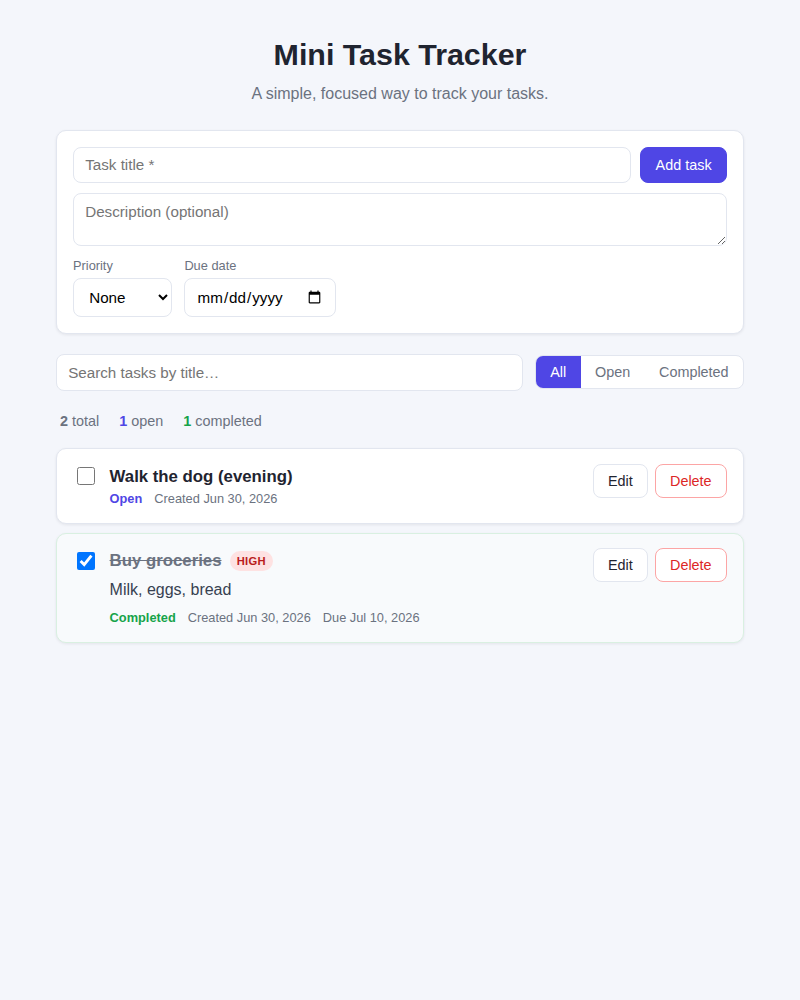

# Mini Task Tracker

A small, usable task tracker: create tasks, view them, mark them complete, filter by status,
and search by title. Built as a clean full-stack example with a React frontend and a FastAPI
backend.

> **Live demo:** Frontend: https://task-manager-vb7e.onrender.com  
> **API:** https://task-manager-api-gp23.onrender.com/api/health



## Features

- **Create** tasks with a required title, optional description, priority (low/medium/high) and due date.
- **View** all tasks, newest first, with status, created date and (optional) due date.
- **Complete** a task with one click — completed tasks are visually struck through.
- **Filter** by All / Open / Completed.
- **Search** tasks by title (server-side, case-insensitive).
- **Edit** and **delete** tasks (inline editing).
- **Task counts** summary (total / open / completed).
- Clear **empty states**, basic **error handling**, and a **responsive** layout.

## Tech stack

| Layer    | Choice |
|----------|--------|
| Frontend | React 18 + TypeScript, Vite |
| Backend  | Python 3.11, FastAPI, Pydantic v2 |
| Storage  | Repository pattern — in-memory by default, SQL (SQLAlchemy) when `DATABASE_URL` is set |
| Tests    | pytest (service + API via TestClient) |
| Deploy   | Frontend → Render, Backend → Render |

## Architecture

The backend is layered so HTTP, business logic and storage stay independent:

```
request → router → service → repository (interface) → in-memory | SQL impl
```

- **Routers** (`app/api/routers/`) handle HTTP only and map domain errors to status codes.
- **Service** (`app/services/task_service.py`) owns all business logic: validation, filtering,
  search, completion and stats.
- **Repository** (`app/repositories/`) is a thin storage boundary. `build_repository()` picks the
  in-memory or SQL implementation based on configuration, so swapping storage is a one-line change.
- **Domain model** (`app/domain/models.py`) is storage-agnostic; **schemas** (`app/schemas/`) define
  the camelCase HTTP contract.

### API

| Method | Path | Description |
|--------|------|-------------|
| `GET`    | `/api/health` | Liveness check |
| `GET`    | `/api/tasks?status=all\|open\|completed&search=<q>` | List with filter + title search |
| `GET`    | `/api/tasks/stats` | Counts: `{ all, open, completed }` |
| `POST`   | `/api/tasks` | Create a task (`201`) |
| `PATCH`  | `/api/tasks/{id}` | Partial update — edit or complete (`404` if missing) |
| `DELETE` | `/api/tasks/{id}` | Delete a task (`204`, `404` if missing) |

Validation (empty/missing title, bad enum/filter values) returns `422`.

## Run locally

You need **Python 3.11+** and **Node 18+**. Use two terminals.

**1. Backend**

```bash
cd backend
python -m venv .venv && source .venv/bin/activate   # optional but recommended
pip install -r requirements.txt
uvicorn app.main:app --reload                        # http://localhost:8000
```

By default the backend allows the Vite dev origin (`http://localhost:5173`). API docs are available
at `http://localhost:8000/docs`.

**2. Frontend**

```bash
cd frontend
npm install
cp .env.example .env        # VITE_API_BASE_URL defaults to http://localhost:8000
npm run dev                  # http://localhost:5173
```

## Run tests

```bash
cd backend
pip install -r requirements.txt
pytest                       # 26 tests: service logic + API contract
```

The frontend is type-checked as part of its build:

```bash
cd frontend
npm run build
```

## Deployment

The two apps deploy independently.

**Backend → Render**
1. New → Blueprint, point at this repo (it reads `backend/render.yaml`), or create a Web Service with
   root directory `backend`, build `pip install -r requirements.txt`, start
   `uvicorn app.main:app --host 0.0.0.0 --port $PORT`.
2. Set `CORS_ORIGINS` to your frontend URL (no trailing slash). Example: `https://task-manager-vb7e.onrender.com`.
3. *(Optional, for durable data)* add a Render Postgres instance and set `DATABASE_URL` to its
   connection string (use the `postgresql+psycopg://…` form). Without it, the API runs in-memory.

**Frontend → Render**
1. New → Static Site, point at this repo and set the project root to `frontend`.
2. Build Command: `npm ci && npm run build`
3. Publish Directory: `dist`
4. Set `VITE_API_BASE_URL` to your Render backend URL: `https://task-manager-api-gp23.onrender.com`
5. Deploy, then update `CORS_ORIGINS` on the backend Render service with the resulting frontend URL if different.

## Known limitations

- **Default storage is in-memory**, so data resets when the backend restarts (and serverless/free
  hosts cold-start frequently). Set `DATABASE_URL` to make it durable — the SQL repository is already
  wired in.
- No authentication or multi-user support (out of scope per the brief). All tasks are shared.
- Search and filtering are simple substring/equality matches — no pagination or full-text search.

## What I'd improve with more time

- Add a Postgres instance to the deploy by default for out-of-the-box persistence.
- Optimistic UI updates instead of refetching after each mutation.
- Frontend component tests (Vitest + React Testing Library) and an end-to-end suite in CI.
- Sorting (by due date / priority) and pagination for large lists.

## Approximate time spent

~2 hours (design, backend, frontend, tests, end-to-end verification, and docs).
